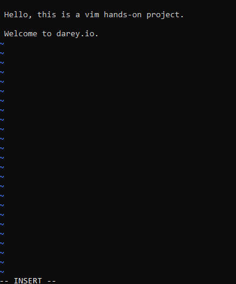
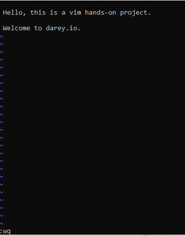
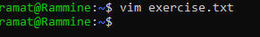
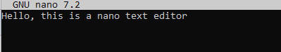
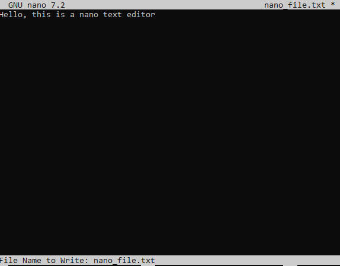
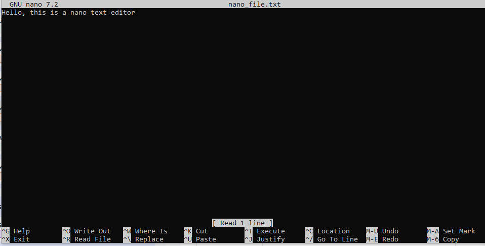
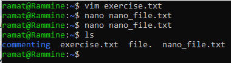

# text-editor

## These are some of the text editors used 
### They are:
- vim editor: vim editor is use to write plain text data writting.

- nano text editor: nano text editor is another way of text writting in code base environments

